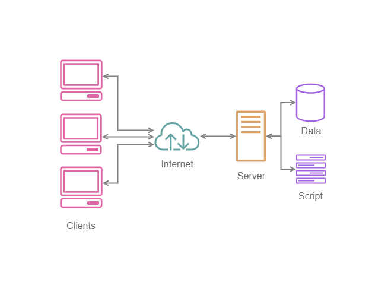
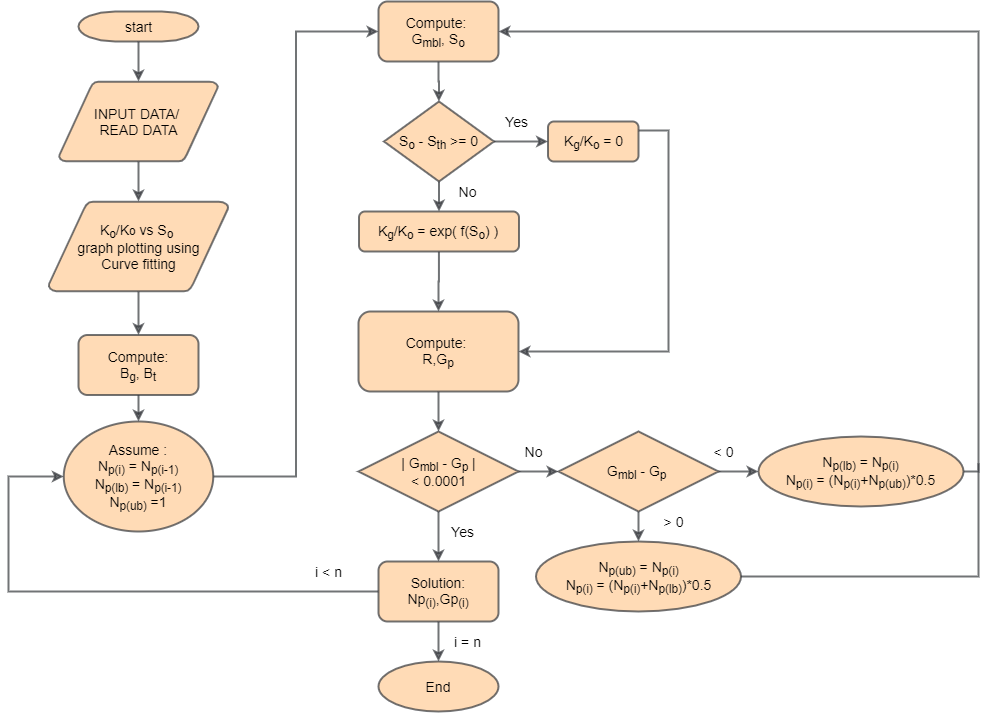
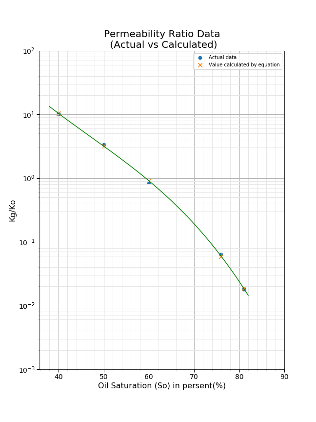
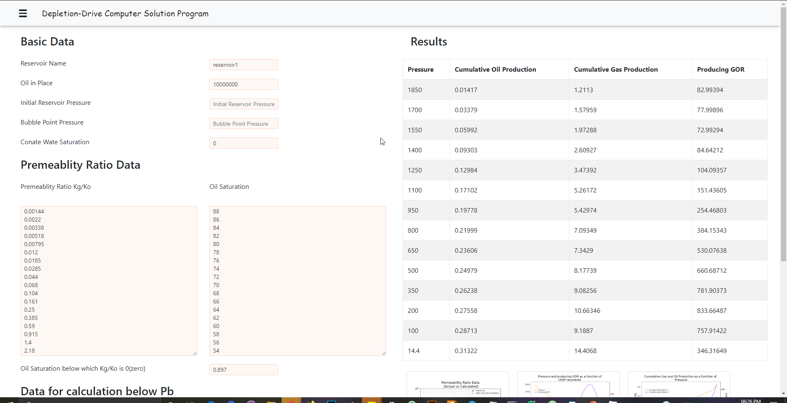
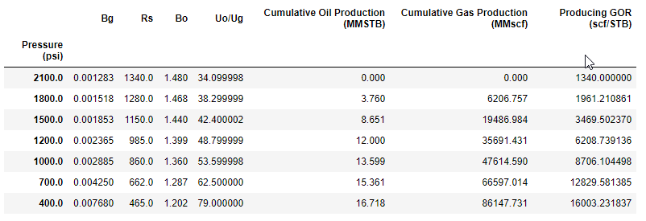

# Depletion Drive Tarner's Method
The purpose of this program is to calculate the future performance of a depletion drive reservoir using `Tarner's method`. Tarner's Method uses the iterative approach to calculate future performance. To achieve the high-speed calculation, Numerical Method is used.

# About Application 

This software is developed to solve the Tarner's Method which is an iterative approach to estimate the reservoir performance. Two type of program. 

#### CLI :

This is the basic approach to solve, all the data input need to feed using terminal. Entering so much of data on command line is tedious, to over come this problem GUI is developed.

#### GUI:

This provides the interactive interface to the user to work with. Architecture of GUI program: 



This architecture of program consists of clients, server and script model. Where clients can communicate to the server and server can provide all the functionality of the program to the client. All this need to have a internet connection. No physical program is need as the application is web based, hence internet browser can server the functionality of the program online.    

  

# Algorithm Flow Diagram



**Note :**

* `i` represent the i<sub>th</sub> pressure stage
* N<sub>p(lb)</sub> and N<sub>p</sub>  are the  lower bound and upper bound  N<sub>p</sub> respectively.  

# Requirements
* Python 3.6 or higher
* NumPy
* Pandas
* Matplotlib

For `GUI app.py`  

* Flask

# To get started

`App.py` Command line.

* Clone this repository:  
```console
git clone https://github.com/tarunk04/Depletion-Drive-Tarner-s-Method.git
```
  or click `Download ZIP` in the right panel of repository and extract it.
* Go App folder 
* Run `app.py`.
* Follow the instruction.
* It will solve and save the plots and save calculated data as `reservoir.csv`.

`App2.py`  GUI Based:

* Run `app2.py`
* It will run the `falsk` server on the `http://127.0.0.1:5000/`. Open this url to use the GUI.

# Permeability Ratio Curve

The relative permeability data is required by the program in the instantaneous GOR equation, and that can be done interpolation of the values. There are several different techniques. A common technique is a least-square fit, sometimes also called a curve fit. 
Curve fitting can be used to fit the So and Kg/Ko data and generate an equivalent function for calculation of Kg/Ko for the required value of So. 
Using this, So and the equation formed using curve fitting (Kg.Ko vs. So Plot.ipynb) can be used to calculate Kg/Ko.


**where**

 where n is the Degree of  polynomial

**where**
A, B, C, .., N is computed using curve fitting.

 


# GUI (Beta Preview):

GUI based `App2` is still in development and may be unstable. Preview below:



**Note : some features are not yet included in GUI app.** 
=======
# Preformance
Tabulation of calculated data is saved in `reservoir.csv` and plot generated is also saved in the working directory.
Example plots and table:



# Example Notebook
Two examples have been included in the repository for understanding the working of the program. Go to the example folder to check or click the links below.

* [Example 1](https://github.com/tarunk04/Depletion-Drive-Tarner-s-Method/blob/master/Examples/Tarner's%20Method%20Example%201.ipynb)
* [Example 2](https://github.com/tarunk04/Depletion-Drive-Tarner-s-Method/blob/master/Examples/Tarner's%20Method%20Example%202.ipynb)

# About the Project
This project is developed by **Tarun Kumar** of **IIT (ISM), Dhanbad** under the supervision of **Prof. Rajeev Upadhyay, Department of Petroleum Engineering, IIT (ISM) Dhanbad**.
